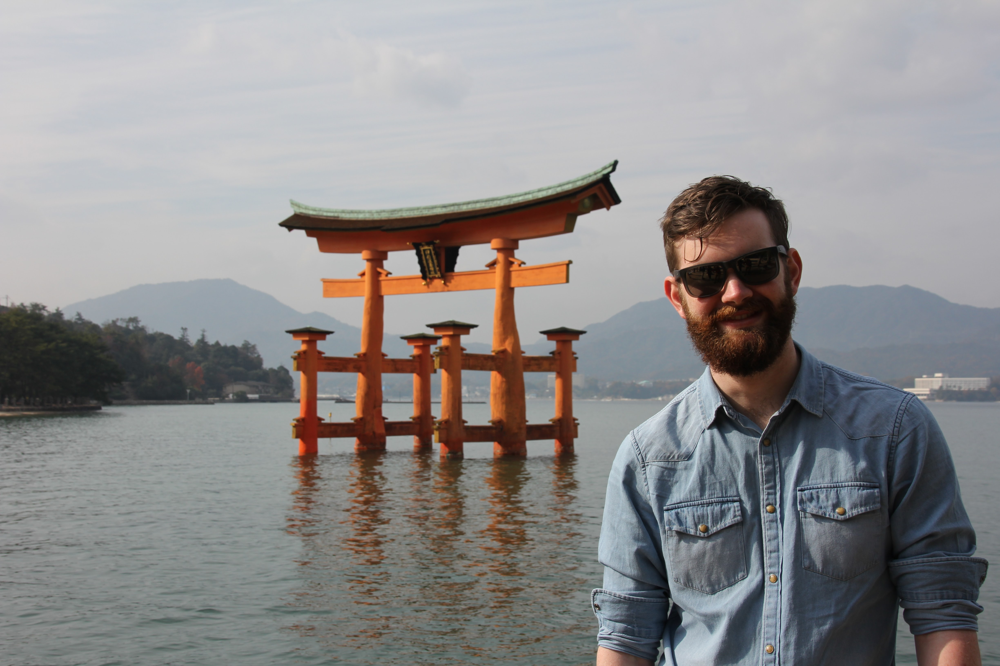

Born in Manchester, England, grew up in Adelaide, South Australia, and now over in Melbourne, Victoria fighting the good fight as a graduate software developer at [REA Group](https://www.realestate.com.au).

I am avid traveller, always looking forward to my next trip around the world, with the eventual goal of working remotely across the world during the progression of my tech career.

*Me, looking exceptionally more bearded than usual at the Itsukushima Shrine, Miyajima, Japan.*

My technical interests are varied, at REA Group we have a strong emphasis on applying functional programming to sensibly solve real world problems. Our language of choice is primarily Scala married with a variety of functional libraries such as [Cats](https://typelevel.org/cats/), [Slick](http://slick.lightbend.com/), and [Circe](https://circe.github.io/circe/) among others.

I am also always looking into other upcoming fields within Computer Science such as Machine Learning, currently studying Introduction to Machine Learning by Andrew Ng via Coursera, with the hope of eventually moving onto the Deep Learning specialization.